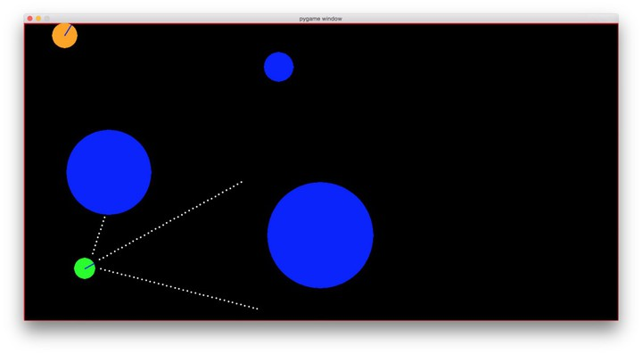
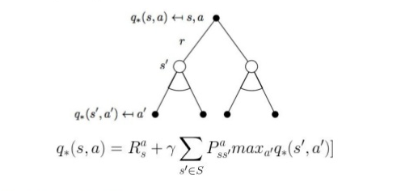
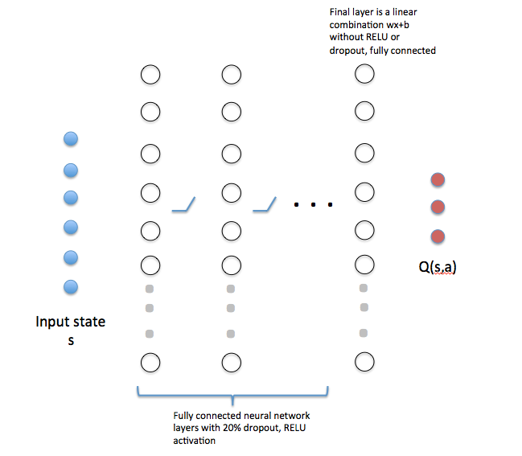
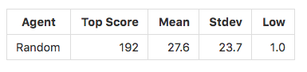
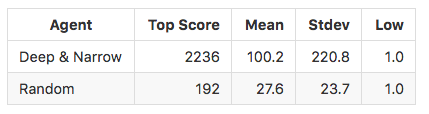
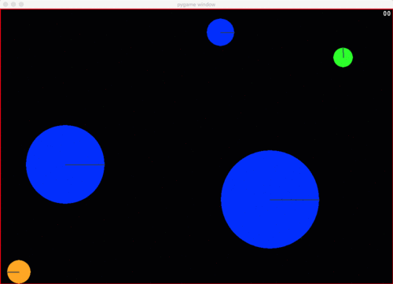
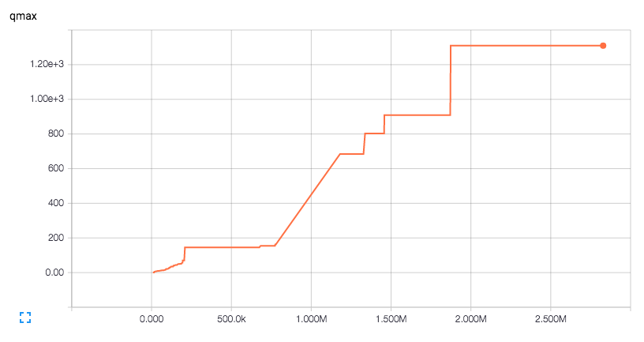

### I. 定义

#### 项目概述

最近，自动驾驶汽车十分火热。但是，自动驾驶问题是一个机器学习集大成的问题，十分的复杂。因此，我们希望可以设计出一个简单的学习环境能够对自动驾驶问题进行模拟，并且不需要GPU （主要是太贵）。

我们的学习环境借鉴了[Matt Harvey's virtual car](https://medium.com/@harvitronix/using-reinforcement-learning-in-python-to-teach-a-virtual-car-to-avoid-obstacles-6e782cc7d4c6#.58wi2s7ct) 的环境设置。运用了 TensorFlow， Python 2.7 以及 PyGame 5.0. 本项目中运用了深度Q强化学习算法，但是为了符合我们上面提到的要求，我们去掉了该算法中 “深度” 的部分。代码设计的一些思想借鉴了 [songotrek's Q学习算法的TensorFlow实现](https://github.com/songrotek/DQN-Atari-Tensorflow/blob/master/BrainDQN_Nature.py).

#### 问题描述



*图片来源于[Matt Harvey's virtual car](https://medium.com/@harvitronix/using-reinforcement-learning-in-python-to-teach-a-virtual-car-to-avoid-obstacles-6e782cc7d4c6#.58wi2s7ct)*

我们所要解决的问题就是设计一个算法使得模拟小车能够自动行驶。

上图就是我们实验用的环境。可以看出，它足够简单，但是足够进行一些强化学习算法的验证。最小的圆圈是我们模拟的小车，它拥有三个声纳感应器 （三条白色的虚线）。三个较大的圆圈代表障碍物，它会随着时间的变化缓慢移动。左上角的圆圈代表一只在环境中游走（速度相比于障碍物要快很多）的猫。圆圈上的缺口表示朝向。我们所要解决的问题就是希望小车可以尽可能长时间的运动，但不会撞到障碍物或者猫。


#### 环境需求

- [Anaconda Python Distribution 2.7](https://www.continuum.io/why-anaconda)
- [TensorFlow for Anaconda](https://www.tensorflow.org/versions/r0.11/get_started/os_setup.html#anaconda-installation)
- [PyGame](http://www.pygame.org/wiki/GettingStarted)，用于展示图形界面
- [PyMunk](http://www.pymunk.org/en/latest/)，为了模拟游戏中的物理环境
- [Numpy](http://www.numpy.org/)
- [Scipy](http://www.scipy.org/)

实验运行的环境为 Ubuntu 16.04 LTS 虚拟机， 虚拟机为VMware Workstation 12.5.2 build-4638234。虚拟机运行在Windows 10 Pro上。


#### 性能度量

我们的baseline是一个随机（行为随机选择）小车，最后的评价指标是我们定义的指标score，代表小车存活的时间（在游戏中代表小车存活的frame）。并且，score是进行1000次实验的平均值。


#### 优化目标

我们使用的是 [Deep Q Learning](https://www.cs.toronto.edu/~vmnih/docs/dqn.pdf) 论文中定义的 QMax 值。

QMax 值指的是在一定时间范围内，对于所有的训练样本，Q 函数（使用神经网络进行拟合）输出的最大的 Q-value。随着agent（模拟小车）不断进行学习，它将采取更加优秀的策略，因此存活时间会更长，那么 Q-value (在我们的实验中便是score) 会越大。如果我们的优化目标是增大 Q-value 的上界，也便相应的增大了 Q-value 值。


#### 学习过程监测

我们使用的是Tensorflow自带的TensorBoard来监测QMax以及最大score的变化情况（希望整体趋势是逐渐增大的）


### 分析

#### 数据

由于强化学习任务的数据集一般都是实验中产生的，因此不需要收集数据。在每一次迭代过程中，模拟环境提供以下数据（自己设计的）：

- s1, s2, s3 三个声纳传感器的数值，范围是[0, 40]，整数值，代表三个方向上障碍物的距离。范围确定为这样的原因是，为了检测障碍物，声纳传感器从源头开始，逐渐往外探测，每向外探测一次，距离就加1（可以看成虚线的点数，即虚线是由多少个点组成的）。
- x 代表x轴的位置，范围是[0, 1]
- y 代表y轴的位置，范围是[0, 1]
- theta 代表小车的方向，弧度表示，范围是[0, 2$\pi$]

小车能够采取的动作如下：

- 0，代表直走
- 1， 往左转0.2弧度
- 2， 往右转0.2弧度

小车每进行一次动作会使得状态发生变化，并且有以下返回值：

- Reward，一个[-100, 10]之间的整数，负数代表动作产生的结果不好，正数则相反
- Termianl，布尔型数据，代表小车是否存活（是否撞到障碍物）

我们和原始模型[1]不同的是，输了$s_1, s_2, s_3$三个特征之外，额外增加了$x, y, theta$三个特征。因为我们希望小车能够尽可能往地图中间运行，远离墙壁。并且当它们靠近障碍物时，能够选择更加合理的方向躲避。

值得说明的一点是，小车如何检测是否撞到障碍物的问题。实验中使用的方法是检测声纳传感器的数值，如果数值是1（而不是0）就认为小车撞上了障碍物，并给出一个-100的reward。此时实验将重新开始，小车位置的选择是根据物理定律模拟的，即根据碰撞的角度给小车一个反向的速度，并且小车的朝向随机变化。这样模拟出一种碰撞后的混乱状态。


#### 算法

下面介绍Deep Q-learning算法。


以上的实验环境可以形式化的表述，如上图所示。我们拥有一个agent（小车），在时间$t$时必须要选择一个动作$a_t$。Agent采取动作与环境进行交互，使得在时间$t+1$时状态变为$s_{t+1}$。同时agent接收到环境给它的一个反馈$r_t$。这样agent就根据$(s_t, a_t, s_{t+1}, r_t)$来决定采取的动作$a_{t+1}$是什么。整个问题就是不断重复上述过程直到到达某个结束条件。

机器学习领域将这个问题称为强化学习问题。每一个动作通过reward被 “强化”，使得agent不断接近我们期望它到达的状态。但是在强化学习中存在一个reward延迟的问题，也就是说，某一个action的回报可能不是即时的，需要很多时间步之后才能确定。举个例子，下棋的过程中需要布局，但是这个布局并不会马上给你带来好处，需要在以后的某个特定时间，你的对上掉入了你很久前设置的陷阱里，这时候才给你带来好处。所以，我们需要采用一种方式来对这个问题进行建模。我们定义一个价值函数$Q(s_t, a_t)$，它表示在状态$s_t$是采取$a_t$这个动作带来的 "价值"，而不是reward，reward是即时的，但是价值是若干时间步带来的reward的某种综合考量，更具实际意义。那么接下来的问题就是价值函数应当如何定义。

最直观的想法就是，我们可以把强化学习问题定义为一个动态规划的问题。这里我直接列出公式，也就是非常著名的贝尔曼方程（Bellman equation）：



可以看到，解决强化学习问题是一个不断迭代的过程，那么如何初始化Q非常重要。但实际上，如果迭代次数趋紧无穷大时，Q的初始值对于最终的结果并没有影响，因此一般来说只要初始化为均值为0的高斯白噪音。

对于小规模的强化学习问题，由于状态的Q值随着迭代次数的增加会不断更新，那么我们需要一个地方来存储这些值。传统的强化学习算法一般采用一张表格（数组或字典）来存储这些值。但是随着问题规模的增大，状态会显著增加。对于我们的问题，状态空间更是无限的，因为状态是由浮点数组成的。这样我们就不可能把这些状态对应的Q值都存储下来。

我们采用一个如下所示的神经网络来代替这些表格，即找出状态和Q值之间的一个映射。这里值得说明的是，网络输出的是所有动作对应的Q值，这是Deep Q-learning算法的一个创新点。



在我们的实验中，输入维度是6维（$s_1, s_2, s_3, x, y, theta$），输出是3维（对应三个动作0， 1， 2）。我们采用白噪音来初始化网络。具体来说，权重采用标准高斯噪音，偏差初始化为0.01。

至于训练过程，Deep Q-learning算法采用了一个trick。该算法采用了两个完全相同的网络，其中一个用来训练，另一个则用来预测。这样还可以防止过拟合。用于训练网络的训练集并不是agent当前的四元组$(s_t, a_t, s_{t+1}, r_t)$， 而是从最近四元组历史（之前某一个时间窗口中的所有四元组）中随机采样出的一个minibatch。我们通过这些训练样本来更新训练网络的参数，经过一定时间的训练之后，把训练网络的参数复制给预测网络，用预测网络来继续产生训练样本，供训练网络使用。整个算法就是不断重复上述过程直至收敛。具体算法的伪代码如下所示：

```python
Initialize replay memory D to size N
Initialize action-value function Q with random weights
for episode = 1, M do
	Initialize state s_1
	for t = 1, T do
		With probability ϵ select random action a_t
		otherwise select a_t=argmax_a  Q(s_t,a; θ_i)
		Execute action a_t in emulator and observe r_t and s_(t+1)
		Store transition (s_t,a_t,r_t,s_(t+1)) in D
		Sample a minibatch of transitions (s_j,a_j,r_j,s_(j+1)) from D
		Set y_j:=
			r_j for terminal s_(j+1)
			r_j+γ*max_(a^') Q(s_(j+1),a'; θ_i) for non-terminal s_(j+1)
		Perform a gradient step on (y_j-Q(s_j,a_j; θ_i))^2 with respect to θ
	end for
end for
```


#### Benchmark

我们希望算法能够比随机选择更好。下面是进行1000次实验随机算法的结果：




### 方法

#### 数据预处理

我们在实验之前进行了数据的标准化，使得所有数据都处于0到1之间，这样可以避免梯度爆炸等现象的发生。

$x， y$ 这两个特征没有进行标准化，因为已经符合要求。$theta$通过除以$2\pi$进行标准化。在没有进行标准化之前，我们在实验中发现，$theta$的值会达到$10^3$这个数量级，使得网络发生了bias shift现象。$s_1, s_2, s_3$通过除以40来进行标准化。

我们同样试着能够将reward也进行标准化，将其范围缩小到[-1, 1]。因为[DQN论文](https://www.cs.toronto.edu/~vmnih/docs/dqn.pdf)中同样使用了这种方法，使得该算法应用在不同的Atari游戏上时不用对算法进行参数的调整。但是，我们在网络训练的前一百万步并没有发现性能有明显的提升。因为reward的值更大的话，学习将会更容易，这样reward信号会更加明显，不会被淹没在网络的高斯噪声中。所以我们希望reward能够大一点，但是多大比较合适又是一个问题。

我们所借鉴的[算法](https://medium.com/@harvitronix/using-reinforcement-learning-in-python-to-teach-a-virtual-car-to-avoid-obstacles-6e782cc7d4c6#.58wi2s7ct)，将这个reward的最小值设置成了-500（小车撞上了障碍物），但我们实验发现这个值设置的过小（下面将会解释），所以最后的范围调整为[-100, 10] （通过裁剪）。我们把这个过程称之为reward正则化。

#### Reward 正则化

在网络训练（反向传播）的过程中，我们希望最小化代价函数。我们的代价函数选为训练网络输出的Q值与训练样本的Q值之间的MSE。在试验过程中，我们发现，对于$s_1, s_2, s_3$值都比较大的状态，其reward都会落在[0, 40]的范围内，并且均值为20。但是网络刚开始训练时，输出值为均值为0的高斯噪声。也就是说初始的loss处于[400-1600]的范围内（由于最后的loss需要除以样本的数量，所以loss等于一个样本的loss）。

现在我们假定网络处于一个最优点附近，这时候小车突然撞上了某个障碍物，那么唯一的可能就是猫出现在了小车后面。这时候就会引入一个250000的loss（如果将reward的最小值设置为-500）。但是网络初始时的loss都只处于[400, 1600]的范围内，这个loss是初始loss的100倍。这么大的loss所引入的梯度将会使得网络走一段非常大的距离，这就很可能直接跳过了局部最优点。不断如此的话，网络就会震荡的非常厉害。

让我们用数学的观点来解释这个问题。当reward的负值设置的过大，将会使得原始问题空间距离最优空间有一个非常大的偏差，很难通过梯度下降靠近。这个大的偏差在问题空间创造了一些非常陡峭的cliff。就像我们爬山一样，好不容易爬到了山顶附近，一不小心就掉下了悬崖，那么我们只能一步一步非常慢的爬上来，花很久的时间才能到达刚才的位置。如果一不小心又掉下去了，那么又要重新爬。

因此，减小reward的范围十分重要，这样可以减小cliff的坡度，使得网络训练更快更容易。但是又不能太小，以免被噪声淹没。最后我们选定了[-100, 10]这个范围。

#### 模型迭代过程

我们最开始直接采用现成的模型，是一个两层的神经网络（不包括输入层），效果已经不错了，但是小车总是撞上障碍物。因此我们做了一些改变：

- 类似DQN，我们使用了最近四次的state，将其映射为一个input，这使得我们的QMax值提高到了120
- 我们继续进行改变，从使用最近四次改为最近16次，使得我们的QMax值提高到了140
- 我们尝试了使用一个更小的网络进行学习（2层，每层32维），并且只使用一个state进行输入，但是结果比随机算法更差。
- 继续尝试使用grid search选择模型，还是两层网络，每一层的维数从32到512，训练迭代次数为200, 000，但是最后的QMax值还是不能超过140。
- 我们尝试了更小的时间窗口，更大的minibatch，网络训练时震荡的十分厉害
- 我们尝试在小车的背面增加一个声纳传感器，发i按网络训练速度变快了，但是最后的QMax值还是不能达到更高。

这些尝试说明应当是两层网络的特征表达能力不够，我们尝试使用更深的网络。最后使用的网络有8层（不算输入输出层），输入层和输出层各有32维，中间6层为64维。最后取得了很好的效果，QMax达到了之前的10倍。

同时，我们在每一层网络后都加入了一个20%的dropout层（除了输入层以及输出层之前），激活函数选用的ReLU函数。


### 实验结果



可以看出，我们的算法性能完全超越了随机算法。

下面是动画演示：



下面是我们训练200,000次后的结果：




但是我们发现小车还是会撞到障碍物，这经常发生在小车碰撞之后的恢复过程中。这时候小车可能到达地图的角落，充满障碍物。但是因为小车只有三个传感器，即使在背面加上还是太少了，所以信息捕捉不够。这是模型需要改进的地方。我们可以事先在小车中存储一个类似于地图的数据。

另外，由于小车一直是匀速行驶，如果加入加速，减速等过程，应当会使得性能更好。但是由于时间原因，我们并没有进一步改进。

#### 进一步工作

本次实验仅仅是在二维环境中进行的。但是严格来说并不是复杂环境的最佳简化。三维环境更加贴近现实情况，例如我们可以设计一个飞行的环境模拟。
